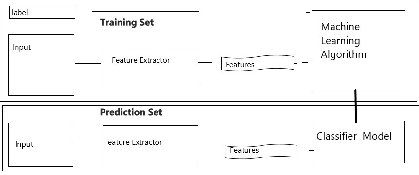
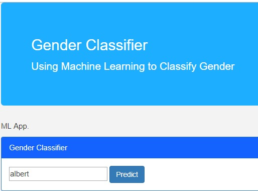
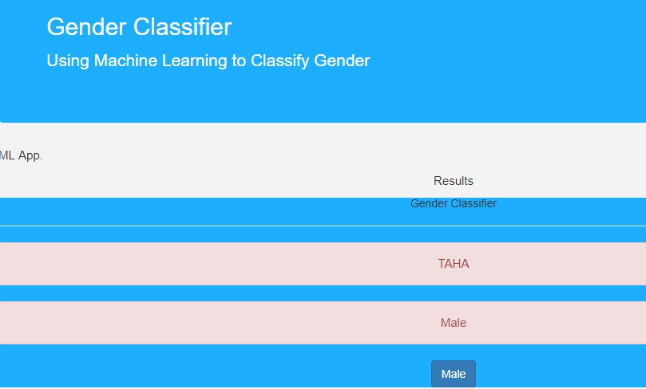

# Gender Detection with Flask
Gender detection with AI and Flask.

# Workflow
--> First step is to find a dataset with all the common names that are used. 
--> The model is trained using different machine learning algorithms and above dataset. 
--> The model created is saved as pkl file and used for prediction.

# How to use 
Visit the website https://gender-classifier.herokuapp.com/ to view the application. Fill the form as shown, file and select the options to get required output.

# How to replicate
Basic requirements- Python 3.7 or above  
Step 1. clone and download the project  
Step 2. run command pip install -r requirements.txt  
Step 3. run command app.py and open localhost:5000 to view the application

# Screenshots of website

